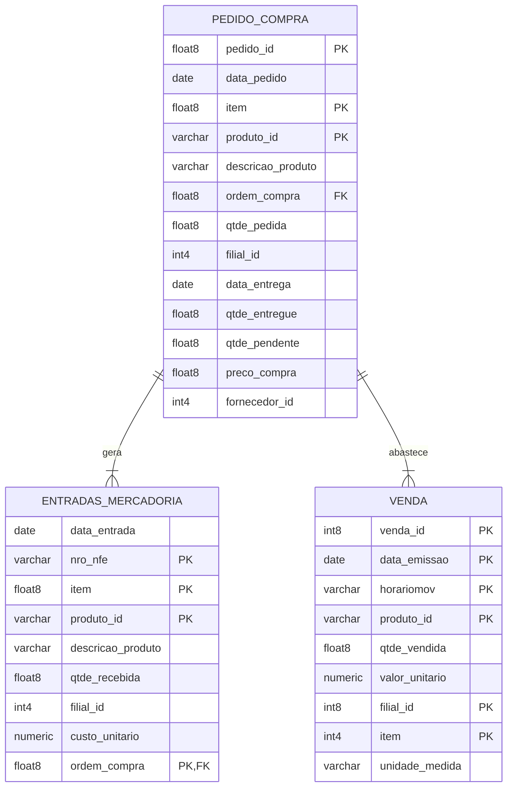

# Diagrama do Banco de Dados

## Fluxos de Negócio

### 1. Fluxo de Compras
1. Criação do Pedido de Compra
   - Registro na tabela `PEDIDO_COMPRA`
   - Campos principais: pedido_id, produto_id, qtde_pedida
   - Status inicial: qtde_pendente = qtde_pedida

2. Recebimento de Mercadoria
   - Registro na tabela `ENTRADAS_MERCADORIA`
   - Vinculação através do campo ordem_compra
   - Atualização de qtde_entregue e qtde_pendente em PEDIDO_COMPRA

### 2. Fluxo de Vendas
1. Registro de Venda
   - Entrada na tabela `VENDA`
   - Controle por filial, produto e data/hora
   - Registro de quantidade e valor unitário

### 3. Fluxo de Análise (Consultas do Desafio)

#### Parte 1 - Análises Básicas
1. Consumo Mensal (Fevereiro/2025)
   - Fonte: Tabela `VENDA`
   - Agrupamento por produto
   - Totalização de qtde_vendida

2. Requisições Pendentes
   - Fonte: Tabela `PEDIDO_COMPRA`
   - Filtro: qtde_pendente > 0
   - Período: Jan-Mar/2025

3. Produtos Não Movimentados
   - Cruzamento das três tabelas
   - Identificação de produtos requisitados sem movimentação

#### Parte 2 - Transformações
- Foco em pedidos frequentes (>10 requisições)
- Formatação de dados para apresentação
- Período: Jan-Mar/2025

#### Parte 3 - Validação
1. Análise de Totais Diários
2. Tempo Médio de Entrega
3. Divergências Pedido vs Recebimento
4. Tendências de Consumo